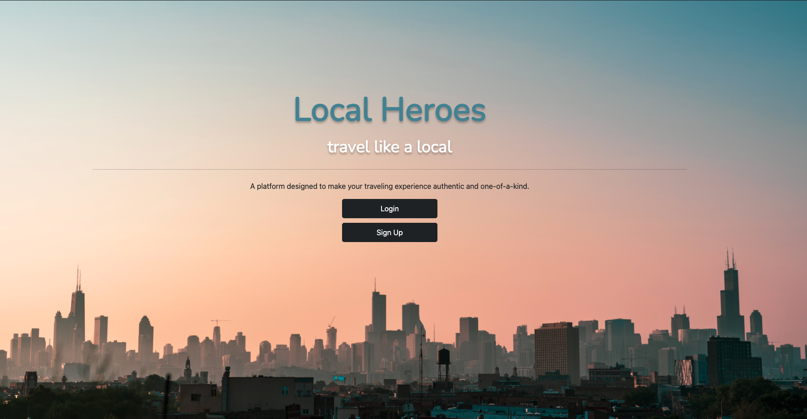
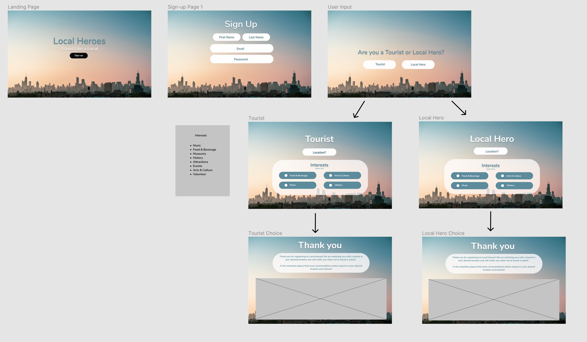
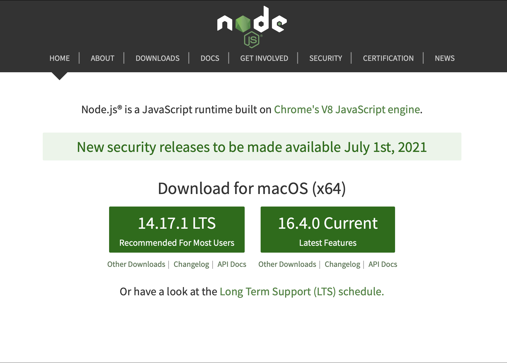

# Local Heroes

#### Table of Contents

- [About](#About)
- [Installation](#Installation)
- [Usage](#Usage)
- [Contribution](#Contribution)
- [License](#License)

# About
Local Heroes was created as a full-stack web application to assist travelers and enhance their traveling experience by connecting to local individuals that have similiar interests. 

# User Story
AS A tourist  
I WANT to connect with local people  
SO THAT I can enhance my traveling through authentic experiences.

# Wireframe

# Installation
To install please visit the [Local Heroes](https://github.com/r0yster/local-heroes) and look at the uploaded files via GitHub Deployment. You may fork the repository and download [Node.js](https://nodejs.org/en/) Additionally, you will need [Visual Studio Code](https://code.visualstudio.com/), [npm](https://www.npmjs.com/), and [Express](https://www.npmjs.com/package/express).The details of how to implement these are provided in the [Usage](#Usage) section below.

# Usage   
To experience Local Heroes please visit our launched application via  **HEROKU LINK HERE**   
✨Wahlah! That's it!✨   
🌇 🏕️ Now go enjoy your next adventurer!  ✅🔥  
## Visual Studio Code
[Visual Studio Code](https://code.visualstudio.com/) (VSC) was used as to create and develeop Local Heroes. VSC is an lightning fast FREE open-source editor designed by [Microsoft](https://www.microsoft.com/en-us/) with developers in mind. Visual Studio code allows developers to easily apply the edit-build-debug cycle, resulting in more productivity on your ideas.

[Visual Studio Code](https://code.visualstudio.com/) brings all that you need as a developer, such as: debugging, instant editing results, customization specifically designed for your preference, hundreds of languages, extensions, version control, and more all at your fingertips!
## Node.js

Node.js was used in combination with VSC. Node.js allows the user to interact with the command line interface instead of the window object. You can download Node [here](https://nodejs.org/en/).

## MySQL
Local Heroes database was tested/seeded using the structured querying language [MySQL](https://www.mysql.com). MySQL is an open-source relational database system that helps organize data into one or more tables and establish relationships between them. 

## npm and Express

[npm](https://www.npmjs.com/package/inquirer) was used in combination with [Express](https://expressjs.com/) to create a backend middleware server. Express is a flexible Node.js application frameworke that provides many features available for both mobile and the web. Please click the referenced information for documentation on npm and Express. Our database was createad using MySQL and our deployment through Heroku. Additional packages include:

## GitHub/Git

In order to make effective changes to the website both [Git](https://gitforwindows.org/) and [GitHub](https://github.com/) were used in synchronization to push commits of the latest updated version.

Git is version control system which allows multiple users to make changes to one single repository.

GitHub is a corporation which provides hosting for version control using Git and software development. [GitHub Docs](https://docs.github.com/en/free-pro-team@latest/github/setting-up-and-managing-your-github-user-account/managing-user-account-settings) provides all needs for setting up your GitHub and answering problem-solving issues you may come across while using GitHub.

# Contribution
Local Heroes would not be possible without these coding heroes:

- [Lexie Crawford](https://github.com/lexcraw4d)
- [Roy Cantu](https://github.com/r0yster)
- [Seve Barrutia](https://github.com/SeveBa)
- [Thelma Sevenier](https://github.com/lexcraw4d/ecommerce-back-end/issues)

Feel free to contribute to this project in any of the following ways:

- [Submit bug and feature requests](https://github.com/lexcraw4d/ecommerce-back-end/issues)
- [Review Source Code Changes](https://github.com/lexcraw4d/ecommerce-back-end/pulls) and make pull requests from typos to content
- For specific concerns that do not meet the above please do not hesitate to reach out to me via [My GitHub](https://github.com/lexcraw4d).

If you are interested in fixing issues directly to the code base, please reference the [How to Contribute](https://github.com/microsoft/vscode/wiki/How-to-Contribute) article.

# License

This source code is available to everyone under the standard [MIT License](https://github.com/microsoft/vscode/blob/master/LICENSE.txt).

